# **CHƯƠNG 1: GIỚI THIỆU ĐỀ TÀI**

## **1.1. Giới thiệu chung**

Trong những năm gần đây, game không chỉ mang tính giải trí mà còn trở thành một lĩnh vực nghiên cứu và ứng dụng công nghệ quan trọng, đặc biệt là các công nghệ đồ họa, lập trình thời gian thực và hệ thống mạng. Trong số các thể loại game phổ biến, **Tower Defense** là thể loại được nhiều người yêu thích nhờ lối chơi chiến thuật, đòi hỏi tư duy và khả năng quản lý tài nguyên hiệu quả.

**Plants vs Zombies** là một trong những tựa game Tower Defense nổi tiếng nhất, được phát triển bởi PopCap Games. Phiên bản gốc của game chủ yếu tập trung vào chế độ chơi đơn (single-player), trong đó người chơi điều khiển các loại cây để ngăn chặn làn sóng zombie do máy điều khiển.

Xuất phát từ ý tưởng đổi mới gameplay truyền thống, nhóm thực hiện đồ án đã phát triển **PvZ-Unity**, một phiên bản **Plants vs Zombies Multiplayer 1v1**, cho phép hai người chơi thật đối kháng trực tiếp với nhau thông qua mạng Internet. Trong đó, một người đảm nhiệm vai trò **Plant**, người còn lại đảm nhiệm vai trò **Zombie**, tạo nên sự đối kháng chiến thuật thời gian thực giữa hai phe.

**Thông tin cơ bản của game:**

* **Tên game:** PvZ-Unity (Plants vs Zombies Unity Multiplayer)
* **Thể loại:** Tower Defense / Real-Time Strategy (RTS) – Multiplayer 1v1
* **Nền tảng:** PC (Windows, macOS, Linux)
* **Độ phân giải:** Full HD (1920 × 1080)

Game được xây dựng với mục đích học tập, nghiên cứu và thực hành các kiến thức về **lập trình game, networking multiplayer và thiết kế hệ thống**.

---

## **1.2. Mục tiêu đồ án**

### **1.2.1. Mục tiêu tổng quát**

Mục tiêu chính của đồ án là xây dựng một game **multiplayer 1v1 hoàn chỉnh** dựa trên gameplay của Plants vs Zombies, cho phép hai người chơi tham gia đối kháng trực tiếp trong thời gian thực thông qua Internet.

### **1.2.2. Mục tiêu cụ thể**

* **Về kỹ thuật**

  * Áp dụng Unity Engine và ngôn ngữ lập trình C# vào phát triển game.
  * Xây dựng hệ thống multiplayer sử dụng Unity Netcode, Relay và Lobby Service.
  * Đồng bộ trạng thái game giữa các người chơi trong thời gian thực.
  * Tích hợp hệ thống xác thực người chơi và quản lý phiên đăng nhập.

* **Về gameplay**

  * Thiết kế hai lối chơi riêng biệt cho hai phe Plant và Zombie.
  * Xây dựng hệ thống tài nguyên (Sun và Brain) độc lập cho từng phe.
  * Cân bằng gameplay giữa tấn công và phòng thủ.
  * Triển khai hệ thống Fusion cho phép ghép cây nâng cấp sức mạnh.

* **Về trải nghiệm người dùng**

  * Thiết kế giao diện trực quan, dễ sử dụng.
  * Tạo hiệu ứng hình ảnh và âm thanh sinh động.
  * Đảm bảo luồng chơi mượt mà từ đăng nhập, matchmaking đến kết thúc trận đấu.

---

## **1.3. Nội dung thực hiện**

Trong quá trình thực hiện đồ án, nhóm đã triển khai các nội dung chính sau:

* **Xây dựng hệ thống game multiplayer**

  * Hệ thống đăng nhập và xác thực người chơi.
  * Lobby và matchmaking tự động ghép cặp người chơi.
  * Kết nối mạng thông qua Unity Relay để hỗ trợ chơi online.

* **Thiết kế gameplay**

  * Gameplay cho phe **Plants**: trồng cây, quản lý Sun, phòng thủ theo từng lane.
  * Gameplay cho phe **Zombies**: triệu hồi zombie, quản lý Brain, tấn công theo chiến thuật.
  * Hệ thống chiến đấu giữa cây và zombie.
  * Hệ thống hiệu ứng trạng thái như Slow, Freeze.

* **Xây dựng hệ thống quản lý game**

  * Quản lý trạng thái trận đấu (Game State Machine).
  * Điều kiện thắng/thua.
  * Đồng bộ dữ liệu và trạng thái giữa các client.

* **Thiết kế giao diện và trải nghiệm người dùng**

  * Giao diện chọn đội hình trước trận.
  * HUD trong quá trình chơi.
  * Giao diện thông báo thắng/thua và các hiệu ứng hỗ trợ.

---

## **1.4. Phạm vi đồ án**

### **1.4.1. Số lượng màn chơi**

* Số lượng scene: **05 scene**

  * Login Scene
  * Lobby Scene
  * Loading Scene
  * Game Scene
  * Test Scene

* Số lượng bản đồ: **01 bản đồ**

  * Sân cỏ cổ điển gồm **5 lane × 9 cột**

### **1.4.2. Các tính năng chính**

* Đăng nhập và xác thực người chơi.
* Tạo và tham gia phòng chơi (Lobby).
* Matchmaking tự động.
* Chọn vai trò Plant hoặc Zombie.
* Chọn đội hình trước khi bắt đầu trận đấu.
* Gameplay đối kháng thời gian thực 1v1.
* Hệ thống tài nguyên (Sun / Brain).
* Hệ thống Fusion ghép cây.
* Hiệu ứng trạng thái và âm thanh.
* Điều kiện thắng/thua rõ ràng.
* Đồng bộ dữ liệu giữa hai người chơi.

Đồ án tập trung vào **chế độ multiplayer 1v1**, không mở rộng sang các chế độ chơi khác hoặc nhiều bản đồ.

---

## **1.5. Cấu trúc báo cáo**

Nội dung báo cáo được tổ chức thành các chương như sau:

* **Chương 1: Giới thiệu đề tài**
  Trình bày tổng quan về đề tài, mục tiêu, nội dung thực hiện và phạm vi đồ án.

* **Chương 2: Phân tích và thiết kế game**
  Phân tích yêu cầu, thiết kế gameplay, kiến trúc hệ thống và sơ đồ lớp.

* **Chương 3: Cài đặt và triển khai**
  Trình bày chi tiết quá trình hiện thực game, các module chính và công nghệ sử dụng.

* **Chương 4: Kết quả và đánh giá**
  Đánh giá kết quả đạt được, ưu điểm, hạn chế và hướng phát triển trong tương lai.

* **Chương 5: Kết luận**
  Tổng kết quá trình thực hiện đồ án và các bài học kinh nghiệm rút ra.

---

# **CHƯƠNG 2: PHÂN TÍCH VÀ THIẾT KẾ GAME**

## **2.1. Ý tưởng game và luật chơi**

### **2.1.1. Ý tưởng cốt lõi**

Đồ án phát triển một phiên bản **Plants vs Zombies** theo hướng **đối kháng người chơi với người chơi (PvP) 1v1** thời gian thực qua Internet. Khác với phiên bản gốc (single-player) nơi người chơi luôn đóng vai **Plants** và chiến đấu với AI, phiên bản này cho phép:

* **Người chơi 1 (Plant):** xây dựng phòng thủ bằng cách trồng cây theo chiến thuật.
* **Người chơi 2 (Zombie):** chủ động triệu hồi và điều phối zombie để tấn công, xuyên thủng tuyến phòng thủ.

Cách tiếp cận này tạo ra tính cạnh tranh trực tiếp, tăng chiều sâu chiến thuật, đồng thời là môi trường phù hợp để triển khai các kỹ thuật **đồng bộ trạng thái (state synchronization)** và **thiết kế gameplay cân bằng**.

---

### **2.1.2. Luật chơi**

#### a) Luật cơ bản

Trận đấu có 2 người chơi, mỗi người đảm nhiệm một phe với mục tiêu khác nhau. Thời lượng mỗi trận là **5 phút (300 giây)**.

| Quy tắc         | Mô tả                                                  |
| --------------- | ------------------------------------------------------ |
| Số người chơi   | 2 (1 Plant, 1 Zombie)                                  |
| Mục tiêu Plant  | Ngăn zombie chạm đích trong thời gian quy định         |
| Mục tiêu Zombie | Đưa ít nhất 1 zombie đến cuối sân (bên trái)           |
| Thời gian trận  | 5 phút                                                 |
| Điều kiện thắng | Zombie chạm đích → Zombie thắng; Hết giờ → Plant thắng |

#### b) Luật phe Plants

Phe Plants vận hành theo cơ chế quản lý tài nguyên **Sun**. Người chơi thu thập Sun và sử dụng để trồng cây lên các ô (tile) trên sân.

* **Nguồn Sun:**

  * Sun rơi từ trời theo chu kỳ (ngẫu nhiên, khoảng mỗi 10 giây).
  * Sun do **Sunflower** sản xuất theo chu kỳ (mỗi 24 giây).
* **Thu thập:** người chơi nhấp để thu thập; vật phẩm sẽ biến mất sau một khoảng thời gian nếu không thu.
* **Giá trị:** mỗi Sun tương đương **25 Sun**.

Ngoài ra, người chơi có thể:

* chọn cây từ **deck tối đa 7 loại** đã chọn trước trận,
* đặt cây lên tile trống,
* chịu ràng buộc **chi phí** và **cooldown** theo từng loại cây,
* dùng **Shovel** để đào bỏ cây,
* sử dụng **Fusion** để ghép cây tạo cây mạnh hơn (nếu đáp ứng điều kiện).

#### c) Luật phe Zombies

Phe Zombies vận hành theo cơ chế quản lý tài nguyên **Brain**. Người chơi thu thập Brain và dùng để triệu hồi zombie theo lane từ phía phải.

* **Nguồn Brain:**

  * Brain rơi từ trời theo chu kỳ (ngẫu nhiên, khoảng mỗi 10 giây).
* **Thu thập:** nhấp để thu thập; vật phẩm biến mất nếu không thu kịp.
* **Giá trị:** mỗi Brain tương đương **25 Brain**.

Người chơi Zombie:

* chọn zombie từ **deck tối đa 7 loại**,
* click vào lane bên phải để spawn zombie,
* mỗi zombie có **chi phí** và **cooldown**,
* zombie di chuyển tự động từ phải sang trái và tấn công cây khi chạm mục tiêu.

---

### **2.1.3. Luồng trận đấu (Match Flow)**

Trận đấu diễn ra theo các bước chính: matchmaking → chọn đội hình → sẵn sàng → đếm ngược → chơi → kết thúc.

**[PLACEHOLDER: Chèn sơ đồ luồng trận đấu]**

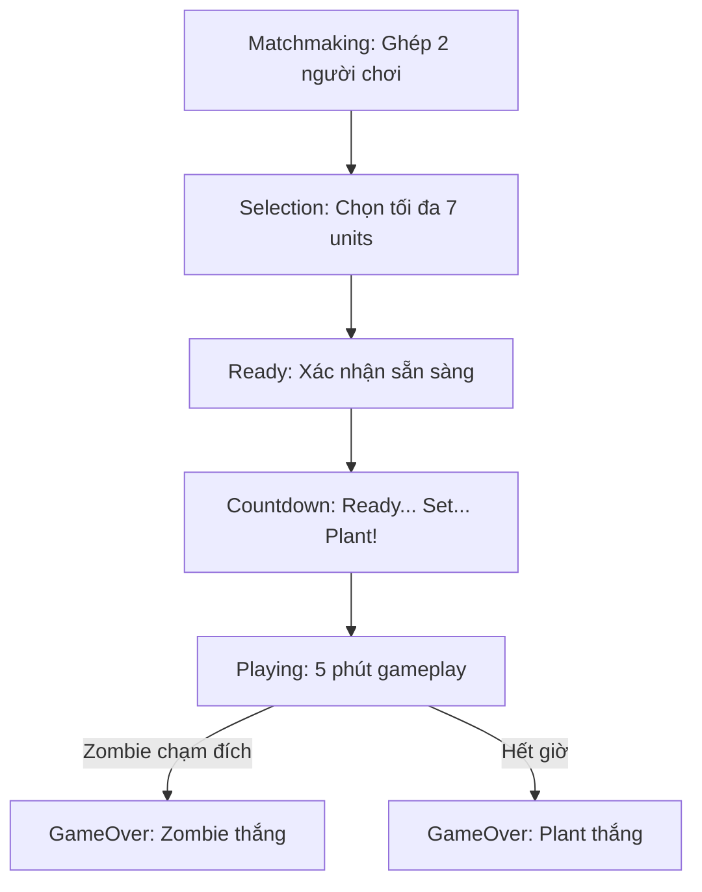

---

## **2.2. Thiết kế hệ thống game**

### **2.2.1. Game State Machine**

Hệ thống sử dụng mô hình **máy trạng thái (State Machine)** để quản lý vòng đời trận đấu nhằm đảm bảo đồng bộ và kiểm soát luồng logic rõ ràng. Các trạng thái chính:

* **Waiting:** chờ đủ 2 người chơi kết nối.
* **Selection:** chọn đội hình (deck) trước trận.
* **Intro:** camera giới thiệu sân chơi.
* **Countdown:** đếm ngược trước khi bắt đầu.
* **Playing:** gameplay chính.
* **GameOver:** kết thúc trận, hiển thị kết quả.

**[PLACEHOLDER: Chèn sơ đồ trạng thái game]**

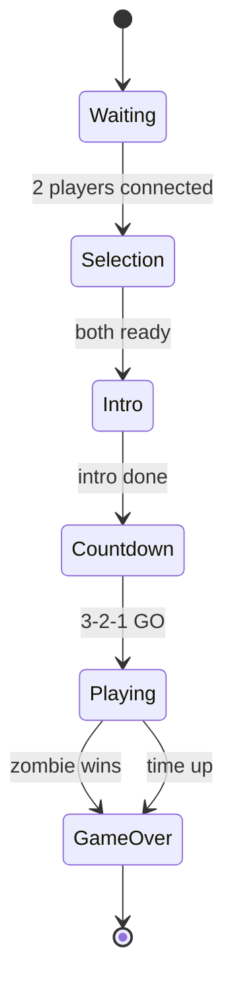

---

### **2.2.2. Thiết kế Grid và Tile**

Bản đồ sân chơi được thiết kế theo cấu trúc **lưới 5 lane × 9 cột**, phù hợp gameplay Tower Defense dạng lane.
Plants được đặt trên các tile; Zombies spawn từ phía phải và di chuyển sang trái tới vùng thắng (win zone).

**[PLACEHOLDER: Chèn sơ đồ grid 5x9]**

```mermaid
flowchart LR
    subgraph L1[Lane 1]
      T11[Tile 1,1]---T12[1,2]---T13[1,3]---T14[1,4]---T15[1,5]---T16[1,6]---T17[1,7]---T18[1,8]---T19[1,9]
    end
    subgraph L2[Lane 2]
      T21[2,1]---T22[2,2]---T23[2,3]---T24[2,4]---T25[2,5]---T26[2,6]---T27[2,7]---T28[2,8]---T29[2,9]
    end
    subgraph L3[Lane 3]
      T31[3,1]---T32[3,2]---T33[3,3]---T34[3,4]---T35[3,5]---T36[3,6]---T37[3,7]---T38[3,8]---T39[3,9]
    end
    subgraph L4[Lane 4]
      T41[4,1]---T42[4,2]---T43[4,3]---T44[4,4]---T45[4,5]---T46[4,6]---T47[4,7]---T48[4,8]---T49[4,9]
    end
    subgraph L5[Lane 5]
      T51[5,1]---T52[5,2]---T53[5,3]---T54[5,4]---T55[5,5]---T56[5,6]---T57[5,7]---T58[5,8]---T59[5,9]
    end

    WZ[Win Zone (Trái)] --> T11
    T19 --> ZS[Zombie Spawn (Phải)]
```

Mỗi tile quản lý trạng thái chiếm chỗ (đã có cây hay chưa), tham chiếu đối tượng đang chiếm (Occupant) và cung cấp vị trí world để đặt cây.

---

### **2.2.3. Thiết kế hệ thống chiến đấu (Combat System)**

Hệ thống combat được thiết kế theo hướng thực thi rõ ràng giữa hai phe:

* Plants tấn công zombie theo nhiều kiểu: **projectile, melee, AOE**.
* Zombie di chuyển theo lane và tấn công cây theo cơ chế **cận chiến** khi tiếp xúc.

**[PLACEHOLDER: Chèn sơ đồ luồng combat]**

```mermaid
flowchart TD
    A[Plants] --> B{Attack Type}
    B --> C[Projectile: Peashooter...]
    B --> D[Melee: BonkChoy...]
    B --> E[AOE: CherryBomb...]
    C --> F[Zombie.TakeDamage()]
    D --> F
    E --> F
    F --> G{Zombie State}
    G --> H[Alive]
    G --> I[Slowed / Frozen]
    G --> J[Dead]
```

Bảng thông số sát thương và nhịp tấn công được định nghĩa nhằm kiểm soát cân bằng giữa các unit (ví dụ Peashooter, Repeater, Cherry Bomb, Bonk Choy và Basic Zombie).

---

### **2.2.4. Thiết kế hệ thống Fusion**

Fusion là cơ chế nâng cấp cây thông qua việc đặt cây tương thích lên tile đang có cây. Khi fusion thành công:

* cây cũ bị loại bỏ,
* cây mới mạnh hơn được sinh ra (upgrade).

**[PLACEHOLDER: Chèn sơ đồ Fusion chuỗi Peashooter]**

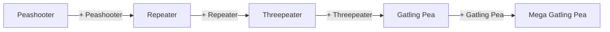

Bên cạnh fusion nâng cấp, hệ thống còn có trường hợp đặc biệt như **Wallnut First Aid**: đặt Wallnut lên Wallnut bị thương để hồi đầy máu thay vì tạo fusion.

---

### **2.2.5. Thiết kế Status Effects**

Game hỗ trợ các hiệu ứng trạng thái để tăng tính chiến thuật, gồm:

* **Slow:** làm giảm tốc độ di chuyển/animation của zombie; có thể cộng dồn theo cơ chế nhân (multiplicative stacking).
* **Freeze:** dừng hoàn toàn zombie (tương đương slow 100%), dừng animation và hiển thị VFX đóng băng.

**[PLACEHOLDER: Chèn sơ đồ áp dụng hiệu ứng lên Zombie]**

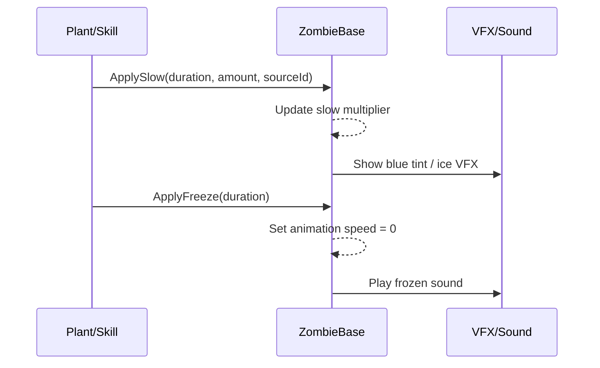

---

## **2.3. Thiết kế nhân vật và màn chơi**

### **2.3.1. Thiết kế Plants**

Plants được phân loại theo vai trò để thuận tiện cân bằng và thiết kế chiến thuật:

* **Offense:** tấn công tầm xa / đa hướng (Peashooter, Repeater, Threepeater, Gatling Pea, Snow Pea…)
* **Defense:** chống chịu, chặn đường (Wallnut)
* **Economy:** tạo tài nguyên (Sunflower, Twin Sunflower)
* **Support:** hỗ trợ/khống chế (Winter-mint, Kernel-pult)
* **Bomb/Trap:** sát thương diện rộng hoặc bẫy (Cherry Bomb, Doom-Shroom, Potato Mine)

**[PLACEHOLDER: Chèn sơ đồ phân loại Plants]**

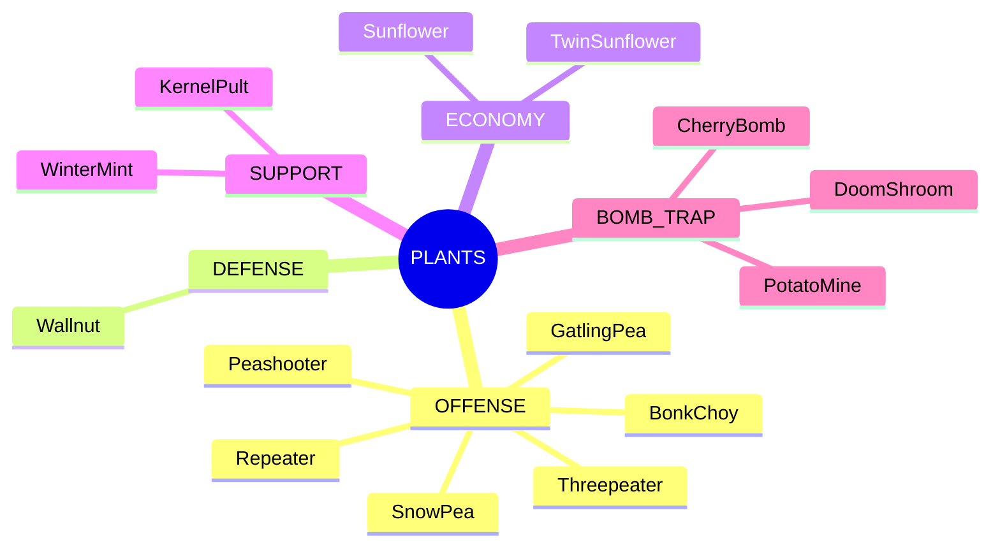

Trong phạm vi đồ án, mỗi plant được mô tả bằng các thuộc tính chính: **HP, chi phí Sun, cooldown, tầm đánh, tốc độ tấn công và hành vi đặc trưng**.

---

### **2.3.2. Thiết kế Zombies**

Zombies được phân loại theo chức năng để tạo đa dạng chiến thuật tấn công:

* **Basic:** zombie cơ bản, chi phí thấp.
* **Rusher:** tốc độ cao, tạo áp lực nhanh (Allstar Zombie).
* **Ranged:** tấn công tầm xa (Cannon, Kamehameha…).
* **Special:** có cơ chế đặc biệt (MixiZombie, Con Trai…).
* **Boss:** đơn vị mạnh (ví dụ Gargantuar trong danh sách định hướng).

**[PLACEHOLDER: Chèn sơ đồ phân loại Zombies]**

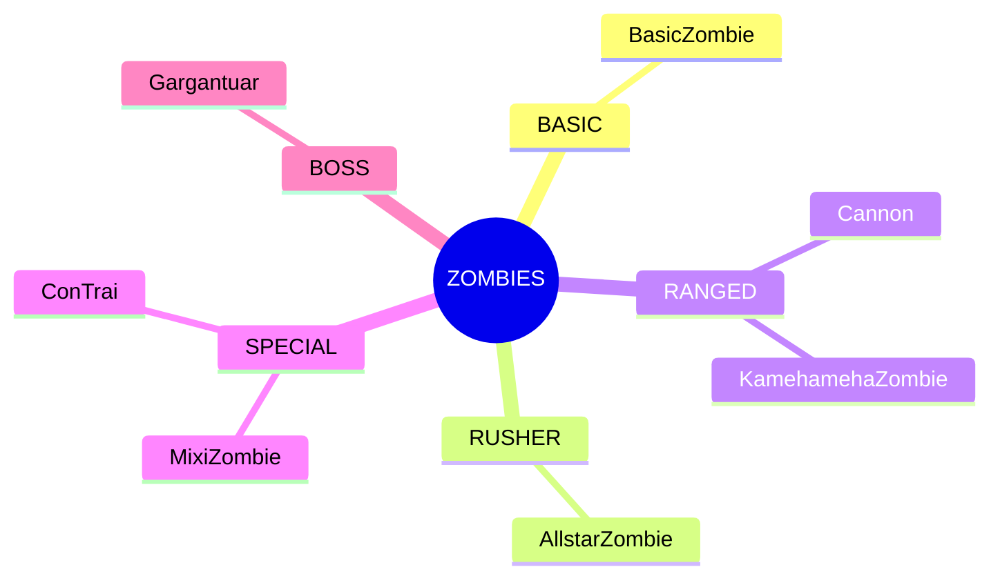

Mỗi zombie được thiết kế với các thuộc tính tiêu chuẩn: **HP, tốc độ di chuyển, sát thương, tốc độ tấn công, chi phí Brain, cooldown**.

---

### **2.3.3. Thiết kế màn chơi**

Game triển khai một bản đồ chính dạng **lawn cổ điển** gồm 5 lane × 9 cột. Thiết kế màn chơi tập trung vào khả năng quan sát và thao tác nhanh cho cả hai phe:

* **Plant HUD** ưu tiên hiển thị Sun, deck cây, thao tác đặt cây và shovel.
* **Zombie HUD** ưu tiên hiển thị Brain, deck zombie và vùng click spawn theo lane.
* Thời gian còn lại hiển thị rõ trong trận để đảm bảo người chơi kiểm soát chiến thuật.

**[PLACEHOLDER: Chèn sơ đồ bố cục màn chơi (layout)]**

```mermaid
flowchart LR
    P[Plant HUD\nSun + Seed Packets + Shovel] --> G[Game Area\n5 lanes x 9 columns]
    Z[Zombie HUD\nBrain + Zombie Packets + Spawn lanes] --> G
    G --> W[Win Zone (Left)]
    S[Spawn Zone (Right)] --> G
```

---

## **2.4. Thiết kế giao diện người dùng (UI)**

### **2.4.1. Login Scene UI**

Giao diện đăng nhập gồm ô nhập username, nút đăng nhập và vùng hiển thị trạng thái kết nối. Mục tiêu là đảm bảo thao tác ngắn gọn, phản hồi rõ ràng khi lỗi kết nối hoặc xác thực.

**[PLACEHOLDER: Chèn screenshot LoginScene UI]**

---

### **2.4.2. Lobby Scene UI**

Giao diện Lobby hỗ trợ:

* hiển thị thông tin người chơi,
* chọn vai trò (Plant/Zombie),
* danh sách lobby khả dụng để tham gia,
* thao tác tạo lobby mới.

Mục tiêu thiết kế là giúp người chơi nhanh chóng vào trận bằng việc giảm số bước thao tác và hiển thị rõ trạng thái phòng.

**[PLACEHOLDER: Chèn screenshot LobbyScene UI]**

---

### **2.4.3. Selection UI (Chọn deck trước trận)**

Màn hình selection cho phép người chơi chọn tối đa **7 units** đưa vào deck. UI thể hiện:

* danh sách unit có thể chọn (grid),
* danh sách unit đã chọn (sidebar),
* nút Ready,
* trạng thái chờ đối phương.

Thiết kế này giúp người chơi kiểm soát đội hình trước trận và đảm bảo cả hai sẵn sàng trước khi bắt đầu.

**[PLACEHOLDER: Chèn screenshot Selection UI]**

---

### **2.4.4. Gameplay HUD**

Trong gameplay, HUD của hai phe được thiết kế riêng để phù hợp thao tác:

* **Plant Player HUD:** Sun counter, seed packets, shovel.
* **Zombie Player HUD:** Brain counter, zombie packets, vùng spawn lane.

Ngoài ra, hệ thống hiển thị **đồng hồ đếm thời gian** và các phản hồi thao tác (đặt cây, spawn zombie, thu thập tài nguyên) nhằm tăng độ rõ ràng cho người chơi.

**[PLACEHOLDER: Chèn screenshot Gameplay HUD - Plant View]**
**[PLACEHOLDER: Chèn screenshot Gameplay HUD - Zombie View]**

---

# **CHƯƠNG 3: CÀI ĐẶT VÀ XÂY DỰNG**

## **3.1. Cấu trúc project trong Unity**

### **3.1.1. Tổng quan cấu trúc thư mục**

Project được tổ chức theo chuẩn Unity, tách rõ tài nguyên (assets), prefab, scene và mã nguồn. Cấu trúc chính gồm:

* **Animations/**: chứa các animation clip và animator controller.
* **Prefabs/**: chứa các đối tượng game đã đóng gói sẵn để spawn trong runtime (Plants, Zombies, UI, Managers…).
* **Scenes/**: chứa các scene tương ứng với luồng game (Login, Lobby, Loading, Game, Test).
* **Scripts/**: chứa mã nguồn chia theo nhóm chức năng (Networking, Plants, Zombies, UI, Utilities…).
* **Sprites/**: chứa bộ sprite lớn phục vụ animation/đồ họa.
* **Resources/**: chứa các tài nguyên cần nạp tại runtime (âm thanh, hiệu ứng…).


Cách tổ chức này giúp dễ quản lý, bảo trì và mở rộng, đặc biệt khi số lượng asset và script tăng lên.

---

### **3.1.2. Phân tầng kiến trúc**

Hệ thống được phân tầng để tách bạch trách nhiệm, giảm phụ thuộc và thuận tiện kiểm thử:

* **Presentation Layer**: xử lý UI/UX, điều hướng và hiển thị thông tin (đăng nhập, lobby, chọn đội hình, HUD…).
* **Game Logic Layer**: chứa logic gameplay cốt lõi (đặt cây, spawn zombie, combat, fusion…).
* **Networking Layer**: quản lý đồng bộ multiplayer, state machine, spawn network object, lobby/relay/auth…
* **Utility Layer**: chứa các thành phần dùng chung như âm thanh, tile/grid, spawner tài nguyên…

**[PLACEHOLDER: Chèn sơ đồ phân tầng kiến trúc]**

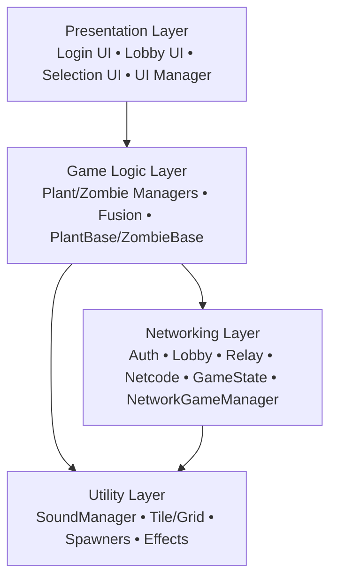

---

### **3.1.3. Tổ chức Prefab**

Prefab được chia theo nhóm để thuận tiện phát triển và tái sử dụng:

* **Prefabs/Plants/**: các prefab của cây (tấn công, phòng thủ, hỗ trợ, kinh tế…).
* **Prefabs/Zombies/**: các prefab zombie theo nhóm chức năng.
* **Prefabs/UI/**: các thành phần UI như seed/zombie packet, dialog, màn hình chọn…
* **Prefabs/Managers/**: các manager dạng singleton phục vụ xuyên scene.

Việc chuẩn hóa prefab giúp quá trình spawn trong multiplayer đồng nhất, giảm rủi ro thiếu tham chiếu và hỗ trợ kiểm soát phiên bản.

---

## **3.2. Cài đặt các chức năng chính**

### **3.2.1. Hệ thống Authentication**

Hệ thống đăng nhập được triển khai theo hướng:

* người chơi nhập **username**,
* hệ thống thực hiện **xác thực (authentication)**,
* tích hợp lưu trữ thông tin người chơi thông qua Unity Services để quản lý dữ liệu người dùng.

Mục tiêu của phần này là đảm bảo:

* người chơi có định danh rõ ràng,
* có thể khởi tạo phiên chơi hợp lệ trước khi vào lobby,
* xử lý lỗi kết nối và retry khi cần.

**[PLACEHOLDER: Chèn sơ đồ luồng Authentication]**

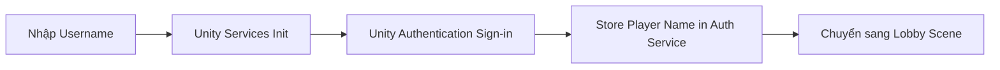

---

### **3.2.2. Hệ thống Lobby & Matchmaking**

Hệ thống lobby chịu trách nhiệm:

* chọn vai trò (Plant/Zombie),
* tạo lobby mới hoặc tham gia lobby đang chờ,
* duy trì lobby bằng cơ chế heartbeat,
* xử lý giới hạn truy cập dịch vụ (rate limit) bằng chiến lược backoff,
* thiết lập Relay để tạo kết nối P2P cho gameplay.

Phần này là bước trung gian đảm bảo cả hai người chơi đã:

* ghép trận thành công,
* đồng bộ role,
* sẵn sàng chuyển sang gameplay.

**[PLACEHOLDER: Chèn sơ đồ luồng Lobby & Matchmaking]**

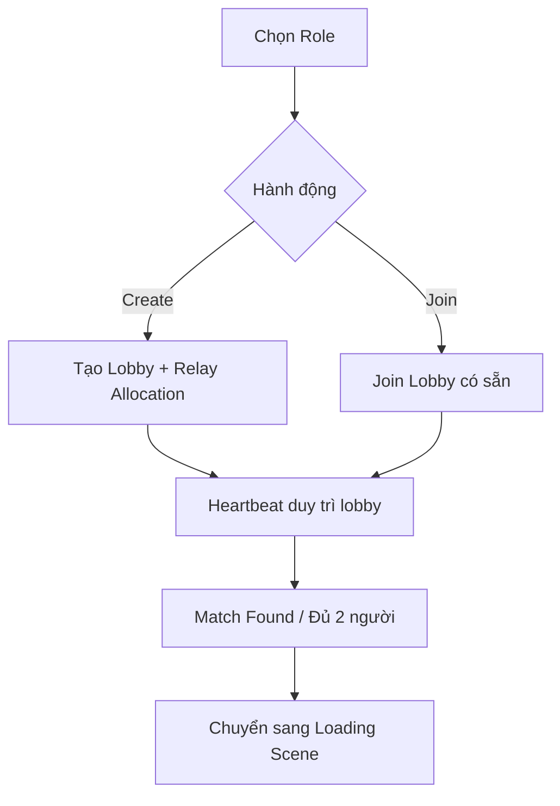

---

### **3.2.3. Hệ thống Network Game (Spawn & Đồng bộ)**

Hệ thống multiplayer áp dụng mô hình **server-authoritative** (host đóng vai server). Các hành động quan trọng như spawn plant/zombie, cập nhật máu, kiểm tra thắng thua… đều được xử lý phía server nhằm:

* tránh gian lận,
* đảm bảo trạng thái thống nhất,
* giảm sai lệch giữa hai client.

**[PLACEHOLDER: Chèn sơ đồ cơ chế spawn server-authoritative]**

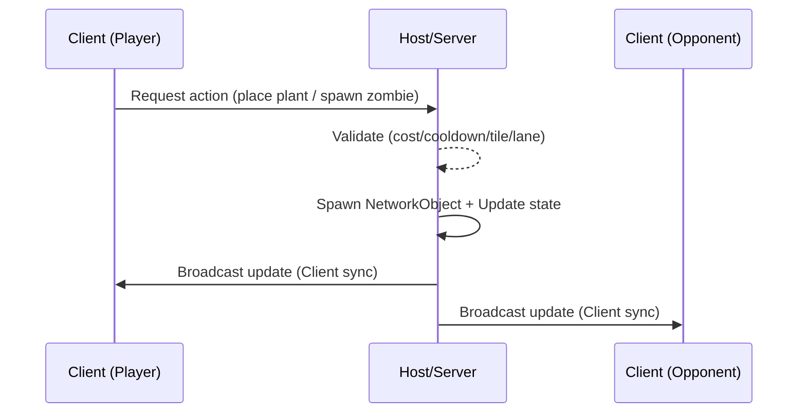

---

### **3.2.4. Hệ thống Plant Management**

Plant Management đảm nhiệm các nhiệm vụ:

* quản lý tài nguyên Sun,
* chọn cây từ deck và hiển thị preview,
* đặt cây lên tile (kiểm tra điều kiện hợp lệ),
* hỗ trợ chế độ Shovel để xóa cây,
* phối hợp với Fusion để nâng cấp cây khi đặt chồng hợp lệ.

Luồng đặt cây được thiết kế theo hướng kiểm tra tuần tự:

* kiểm tra lựa chọn,
* kiểm tra tile hợp lệ,
* kiểm tra tài nguyên,
* kiểm tra cooldown,
* kiểm tra fusion (nếu tile đã có cây),
* gửi yêu cầu spawn hợp lệ đến networking layer.

**[PLACEHOLDER: Chèn sơ đồ luồng đặt cây]**

```mermaid
flowchart TD
  A[Chọn Plant] --> B[Hiển thị Preview]
  B --> C[Click Tile]
  C --> D{Tile hợp lệ?}
  D -->|No| X[Hủy thao tác]
  D -->|Yes| E{Đủ Sun?}
  E -->|No| X
  E -->|Yes| F{Cooldown sẵn sàng?}
  F -->|No| X
  F -->|Yes| G{Tile đã có cây?}
  G -->|No| H[Spawn Plant (Server)]
  G -->|Yes| I[Try Fusion / First Aid]
  I -->|OK| J[Spawn Plant nâng cấp / Restore]
  I -->|Fail| X
```

---

### **3.2.5. Hệ thống Fusion**

Fusion được thiết kế nhằm tạo chiều sâu phát triển chiến thuật cho phe Plants. Hai dạng chính:

* **Fusion nâng cấp**: ghép theo công thức để tạo cây cấp cao hơn.
* **Trường hợp đặc biệt**: ví dụ cơ chế “First Aid” cho Wallnut (hồi phục thay vì nâng cấp).

Hệ thống Fusion giúp:

* khuyến khích người chơi tối ưu tài nguyên,
* tạo tiến trình sức mạnh theo thời gian trận,
* tăng sự đa dạng trong quyết định chiến thuật.

---

## **3.3. AI, Animation, Audio**

### **3.3.1. AI System (Zombie Behavior)**

Zombie AI không sử dụng NavMesh mà áp dụng hướng tiếp cận đơn giản, phù hợp game lane-based 2D:

* zombie di chuyển theo hướng cố định (phải → trái),
* phát hiện plant phía trước bằng kiểm tra va chạm/physics,
* nếu gặp plant thì dừng lại và tấn công theo nhịp,
* khi plant bị phá hủy thì tiếp tục di chuyển.

Thiết kế này giúp AI:

* ổn định, dễ đồng bộ mạng,
* hiệu năng tốt,
* dễ mở rộng thêm hành vi đặc biệt cho từng zombie.

**[PLACEHOLDER: Chèn sơ đồ FSM AI Zombie]**

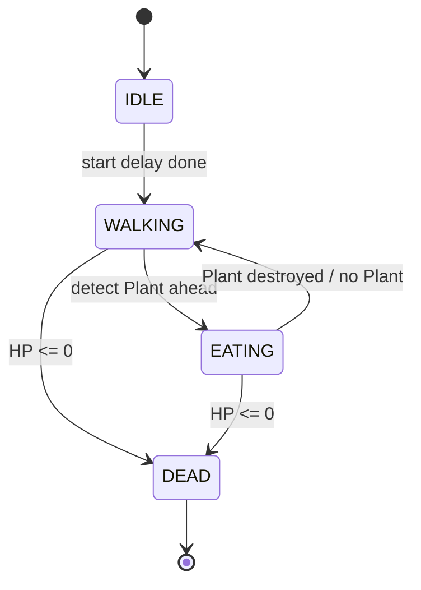

---

### **3.3.2. Animation System**

Hệ thống animation triển khai bằng Unity Animator kết hợp **Animation Events** để:

* đồng bộ hành động với frame animation (ví dụ thời điểm bắn đạn),
* đảm bảo cảm giác “đúng nhịp” giữa hình ảnh và logic,
* đồng bộ hiệu ứng animation giữa các client thông qua networking layer.

Các đối tượng chính (Plants/Zombies) đều có animator parameters để chuyển state (idle, attack, hit, die…).

**[PLACEHOLDER: Chèn sơ đồ animation flow ví dụ tấn công]**

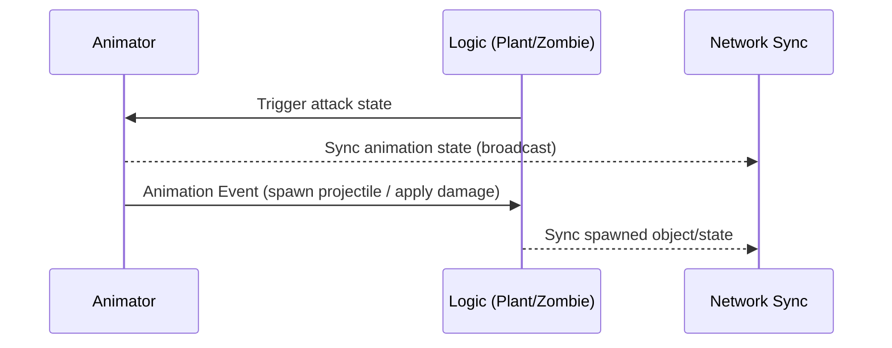

---

### **3.3.3. Audio System**

Hệ thống âm thanh được thiết kế theo hướng:

* quản lý tập trung thông qua Sound Manager,
* hỗ trợ nhiều biến thể âm thanh (variation) để giảm lặp,
* tối ưu hiệu năng bằng **object pooling** cho AudioSource,
* đồng bộ sự kiện âm thanh quan trọng giữa các client để đảm bảo trải nghiệm nhất quán.

Âm thanh được tổ chức theo từng nhóm sự kiện: bắn đạn, đặt cây, thu tài nguyên, zombie spawn, đóng băng, nổ bom, thắng/thua…

---

## **3.4. Quản lý Scene và Game State**

### **3.4.1. Scene Management**

Game gồm 5 scene phục vụ theo luồng chức năng:

* **LoginScene**: đăng nhập và khởi tạo dịch vụ.
* **LobbyScene**: chọn role, tạo/join lobby, chờ ghép trận.
* **LoadingScene**: thiết lập relay, kết nối host/client, chuẩn bị vào trận.
* **GameScene**: chọn deck, intro, countdown, gameplay và kết thúc trận.
* **TestScene**: phục vụ kiểm thử offline trong giai đoạn phát triển.

**[PLACEHOLDER: Chèn sơ đồ luồng scene]**

```mermaid
flowchart LR
  A[LoginScene] --> B[LobbyScene]
  B --> C[LoadingScene]
  C --> D[GameScene]
  E[TestScene\n(Dev only)]:::dev

  classDef dev stroke-dasharray: 5 5;
```

---

### **3.4.2. Game State Machine**

Trong GameScene, trạng thái trận đấu được quản lý bởi state machine gồm các trạng thái:

* Waiting → Selection → Intro → Countdown → Playing → GameOver

Các trạng thái này được đồng bộ giữa hai client bằng cơ chế biến trạng thái mạng (networked state), đảm bảo:

* cả hai người chơi luôn ở cùng một phase,
* tránh tình huống một client đã bắt đầu chơi trong khi client còn lại chưa sẵn sàng.

**[PLACEHOLDER: Chèn sơ đồ state machine]**

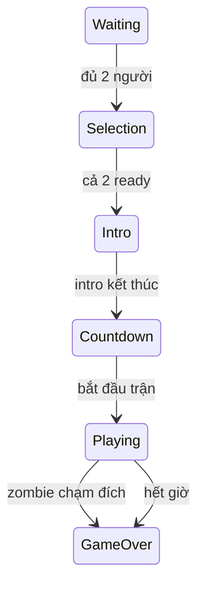

---

### **3.4.3. Đồng bộ dữ liệu trọng yếu**

Các dữ liệu quan trọng được đồng bộ theo hướng **server → all clients**, bao gồm:

* trạng thái game hiện tại,
* trạng thái ready của mỗi phe,
* thời gian còn lại,
* người thắng,
* các biến trạng thái gameplay quan trọng như máu (HP) của unit.

Cách tiếp cận này đảm bảo kết quả thắng/thua không bị sai khác giữa hai người chơi.

---

## **3.5. Các kỹ thuật nâng cao đã áp dụng**

### **3.5.1. Singleton Pattern**

Các hệ thống quản lý cốt lõi được triển khai theo Singleton để:

* dễ truy cập từ nhiều scene/module,
* đảm bảo chỉ tồn tại một instance tại runtime,
* thuận tiện quản lý vòng đời đối tượng (đặc biệt cho manager dùng xuyên scene).

Ví dụ nhóm manager: Lobby, NetworkGame, GameState, Plant, Zombie, Fusion, UI, Sound.

---

### **3.5.2. Object Pooling**

Object Pooling được áp dụng chủ yếu cho hệ thống âm thanh nhằm:

* giảm chi phí tạo/hủy đối tượng AudioSource liên tục,
* tối ưu hiệu năng trong các tình huống nhiều sự kiện âm thanh xảy ra cùng lúc,
* hạn chế giật lag trong trận.

---

### **3.5.3. Server-Authoritative Architecture**

Kiến trúc server-authoritative được áp dụng để:

* server kiểm tra hợp lệ thao tác (đặt cây/spawn zombie),
* server xử lý sát thương, chết, despawn và điều kiện thắng/thua,
* client chủ yếu gửi yêu cầu và hiển thị kết quả đồng bộ.

Điều này giúp giảm nguy cơ gian lận và đảm bảo tính nhất quán.

---

### **3.5.4. RPC Pattern**

Hệ thống multiplayer sử dụng mô hình gọi hàm từ xa:

* client gửi yêu cầu hành động lên server (đặt cây, ready…),
* server phát sự kiện xuống tất cả client (spawn, animation, âm thanh…).

Nhờ đó, các hành động được thực thi thống nhất và đồng bộ.

---

### **3.5.5. Status Effect System (Multiplicative Stacking)**

Hệ thống slow/freeze được thiết kế theo cơ chế cộng dồn dạng nhân để:

* tránh cộng dồn tuyến tính gây mất cân bằng (slow quá mạnh),
* cho phép nhiều nguồn hiệu ứng tồn tại đồng thời,
* dễ kiểm soát tổng ảnh hưởng cuối cùng lên tốc độ zombie.

---

### **3.5.6. Animation Events**

Animation Events được sử dụng để liên kết logic với thời điểm trong animation (ví dụ thời điểm bắn đạn), giúp:

* cảm giác chiến đấu “đúng nhịp”,
* giảm sai lệch giữa hình và logic,
* hỗ trợ đồng bộ gameplay multiplayer ổn định.

---

### **3.5.7. Exponential Backoff**

Khi gọi dịch vụ lobby/heartbeat gặp giới hạn tần suất (rate limit), hệ thống áp dụng backoff để:

* giảm số lần retry liên tiếp,
* tránh bị chặn dịch vụ,
* tăng độ ổn định khi nhiều người chơi truy cập.

**[PLACEHOLDER: Chèn sơ đồ backoff khi heartbeat lỗi]**

```mermaid
flowchart TD
  A[Send Heartbeat] --> B{Thành công?}
  B -->|Yes| C[Reset error counter\nTiếp tục theo chu kỳ]
  B -->|No| D[Increase error counter]
  D --> E[Delay = min(base * 2^n, max)]
  E --> A
```

---

# **CHƯƠNG 4: KẾT QUẢ ĐẠT ĐƯỢC**

## **4.1. Các chức năng đã hoàn thành**

### **4.1.1. Tổng quan kết quả**

Sau quá trình phân tích, thiết kế và triển khai, đồ án **PvZ-Unity** đã hoàn thành đầy đủ các chức năng cốt lõi theo mục tiêu ban đầu. Game được triển khai thành công trên nền tảng **PC**, hỗ trợ chế độ **multiplayer online 1v1** với hai người chơi tham gia đồng thời.

Tổng cộng **20 chức năng chính** đã được hiện thực và kiểm thử ổn định, bao phủ đầy đủ các khía cạnh: xác thực người dùng, kết nối mạng, gameplay, giao diện và luồng trận đấu.

### **4.1.2. Các nhóm chức năng đã triển khai**

* **Authentication & User Management**

  * Đăng nhập bằng Unity Authentication
  * Tích hợp PlayFab để quản lý dữ liệu người chơi

* **Lobby & Matchmaking**

  * Tạo phòng chơi (Lobby)
  * Tìm và tham gia phòng chơi
  * Chọn vai trò Plant hoặc Zombie

* **Gameplay**

  * Đặt cây theo grid/tile
  * Triệu hồi zombie theo lane
  * Hệ thống tài nguyên Sun/Brain
  * Combat system (Projectile, Melee, AOE)
  * Hiệu ứng trạng thái Slow và Freeze
  * Hệ thống Fusion ghép cây
  * Công cụ Shovel và preview vị trí đặt cây

* **Game Flow & Networking**

  * Game State Machine với 6 trạng thái
  * Đồng bộ trạng thái realtime giữa 2 client
  * Điều kiện thắng/thua và giới hạn thời gian 5 phút

### **4.1.3. Kết quả triển khai nhân vật**

* **Plants:** triển khai **16 loại cây**, bao gồm các nhóm Offense, Defense, Economy, Support và Bomb/Trap.
* **Zombies:** triển khai **10 loại zombie**, bao gồm Basic, Rusher, Ranged, Special và Boss.

Các nhân vật hoạt động ổn định, có hành vi và thông số đúng theo thiết kế, đồng thời tương tác chính xác trong môi trường multiplayer.

### **4.1.4. Hệ thống Fusion**

Hệ thống Fusion cho phép nâng cấp cây thông qua việc ghép các cây tương thích. Ngoài các chuỗi fusion nâng cấp hỏa lực (Peashooter → Mega Gatling Pea), hệ thống còn hỗ trợ các hành vi đặc biệt như **Wallnut First Aid** để hồi phục máu.

---

## **4.2. Hình ảnh gameplay minh họa**

> **Lưu ý:** Các hình ảnh minh họa trong mục này được chụp trực tiếp từ game trong quá trình chạy thực tế.

### **4.2.1. Màn hình đăng nhập (Login Scene)**

**[PLACEHOLDER: Chèn screenshot Login Scene]**

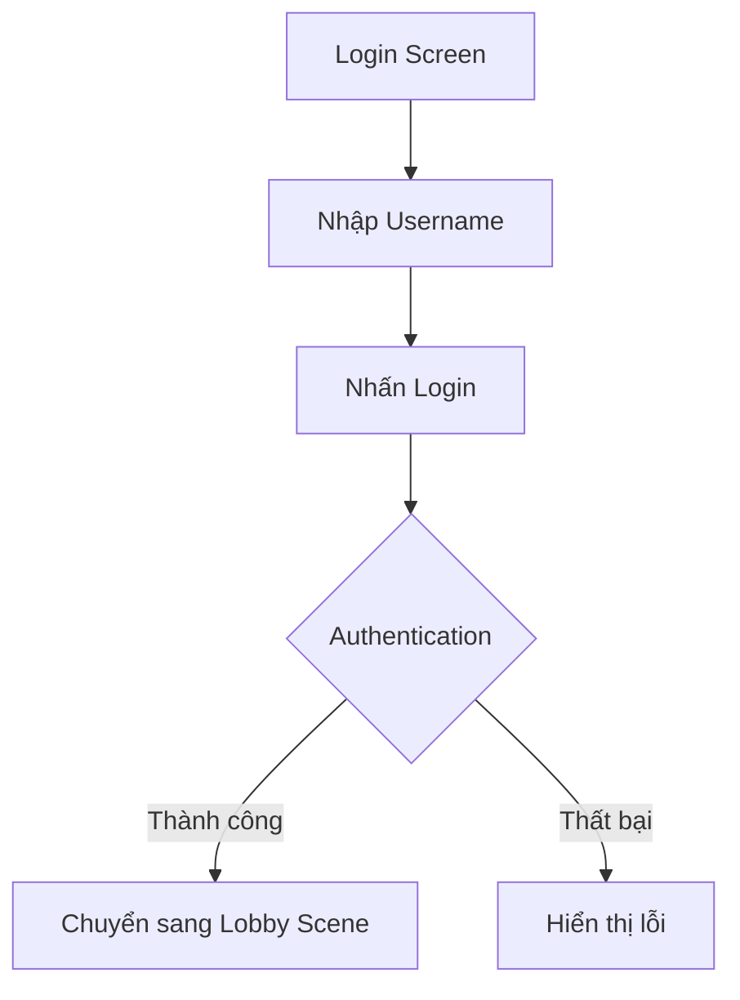

---

### **4.2.2. Màn hình Lobby**

Màn hình Lobby cho phép người chơi chọn vai trò, tạo phòng hoặc tham gia phòng có sẵn, đồng thời hiển thị danh sách các lobby đang chờ.

**[PLACEHOLDER: Chèn screenshot Lobby Scene]**

```mermaid
flowchart LR
    A[Lobby Scene] --> B[Chọn Role]
    B --> C[Tạo Lobby]
    B --> D[Join Lobby]
    C --> E[Chờ người chơi thứ 2]
    D --> E
```

---

### **4.2.3. Màn hình Gameplay**

Màn hình gameplay hiển thị đầy đủ HUD cho từng phe:

* Phe Plants: Sun counter, seed packets, shovel.
* Phe Zombies: Brain counter, zombie packets, lane spawn.

**[PLACEHOLDER: Chèn screenshot Gameplay Scene]**

```mermaid
flowchart LR
    P[Plant HUD] --> G[Game Area]
    Z[Zombie HUD] --> G
    G --> W[Win Zone]
```

---

## **4.3. Đánh giá mức độ đáp ứng mục tiêu**

### **4.3.1. Đánh giá theo mục tiêu kỹ thuật**

* Hệ thống **networking multiplayer** hoạt động ổn định với Unity Netcode và Relay.
* Game State Machine quản lý đầy đủ vòng đời trận đấu.
* Dữ liệu và trạng thái được đồng bộ realtime giữa hai client.

**Kết luận:** Đáp ứng đầy đủ các mục tiêu kỹ thuật đề ra.

### **4.3.2. Đánh giá theo mục tiêu gameplay**

* Gameplay hai phe có cơ chế riêng biệt nhưng cân bằng.
* Số lượng units đa dạng, hỗ trợ nhiều chiến thuật khác nhau.
* Fusion và Status Effects tạo chiều sâu chiến thuật rõ rệt.

**Kết luận:** Gameplay đạt yêu cầu về tính hoàn chỉnh và tính cạnh tranh.

### **4.3.3. Đánh giá theo mục tiêu trải nghiệm người dùng**

* Giao diện trực quan, dễ sử dụng.
* Hiệu ứng hình ảnh và âm thanh phong phú.
* Luồng chơi mượt mà từ đăng nhập đến kết thúc trận.

**Kết luận:** Trải nghiệm người dùng đạt mức tốt trong phạm vi đồ án.

---

# **CHƯƠNG 5: KẾT LUẬN VÀ HƯỚNG PHÁT TRIỂN**

## **5.1. Kết luận**

Đồ án **PvZ-Unity** đã hoàn thành mục tiêu xây dựng một game **Plants vs Zombies Multiplayer 1v1** hoàn chỉnh trên nền tảng PC. Dự án đã thành công trong việc chuyển đổi gameplay Tower Defense single-player sang mô hình đối kháng PvP thời gian thực.

Về tổng thể, đồ án:

* Đáp ứng đầy đủ các yêu cầu kỹ thuật và gameplay đề ra.
* Áp dụng hiệu quả Unity Engine, C# và các dịch vụ Unity Gaming Services.
* Tạo ra một sản phẩm có tính học thuật và thực tiễn cao trong lĩnh vực phát triển game.

Dự án cũng giúp nhóm thực hiện tích lũy nhiều kinh nghiệm quan trọng về **multiplayer networking**, **quản lý trạng thái game**, **thiết kế gameplay** và **tích hợp dịch vụ cloud**.

---

## **5.2. Hướng phát triển trong tương lai**

### **5.2.1. Mở rộng nội dung gameplay**

* Thêm các bản đồ mới (Pool, Night, Roof).
* Bổ sung thêm nhiều loại Plants và Zombies.
* Cải thiện cân bằng gameplay dựa trên phản hồi người chơi.

### **5.2.2. Mở rộng tính năng**

* Ranked mode và leaderboard.
* Replay và spectator mode.
* Achievement system và nhiệm vụ hàng ngày.

### **5.2.3. Cải tiến kỹ thuật**

* Chuyển sang mô hình **dedicated server**.
* Tối ưu hiệu năng bằng object pooling.
* Tăng cường bảo mật và chống gian lận.
* Tích hợp analytics và pipeline CI/CD.

**[PLACEHOLDER: Chèn sơ đồ roadmap phát triển]**

```mermaid
timeline
    title Roadmap phát triển PvZ-Unity
    2026 Q1 : Thêm maps và units mới
    2026 Q2 : Ranked, Leaderboard, Replay
    2026 Q3 : 2v2 Mode, Tournament
    2026 Q4 : Mobile port, Cross-platform
```
